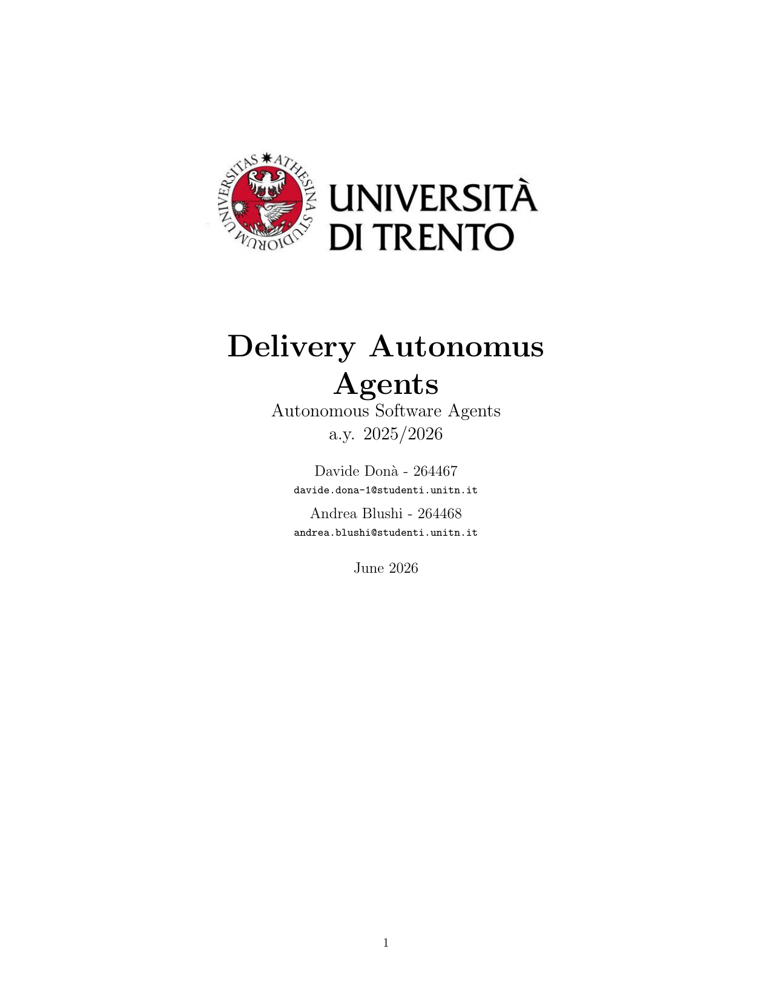
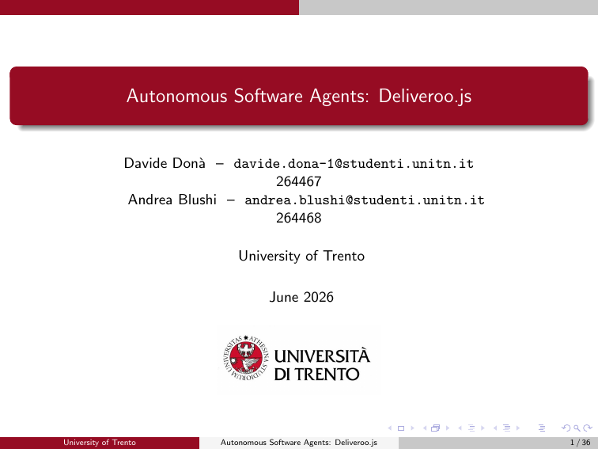

# Delivery Autonomous Agents

A project focused on the development and analysis of autonomous software agents, exploring their design, implementation, and applications in the Deliveroo.js domain, for the University of Trento.

<table align="center">
  <tr>
    <td align="center">
      <strong>
        <a href="docs/report/report.pdf">View Full Report (PDF)</a>
      </strong><br><br>
      <a href="docs/report/report.pdf">
        
      </a>
    </td>
    <td align="center">
      <strong>
        <a href="docs/presentation/presentation.pdf">View Full Presentation (PDF)</a>
      </strong><br><br>
      <a href="docs/presentation/presentation.pdf">
        
      </a>
    </td>
  </tr>
</table>

**Course:** Autonomous Software Agents  
**Professors:** Prof. Paolo Giorgini, Prof. Marco Robol  
**Authors:** Davide Donà, Andrea Blushi

---

# Overview

## Prerequisites

- Node.js (version 14 or higher)
- npm (Node Package Manager)

## Setup Environment

Copy the `.env.example` file to `.env` and fill in the required values:

```bash
cp .env.example .env
```

By default the agent connects to a local Deliveroo.js server at `http://localhost:8080`.
To start the server, follow the instructions in the [Deliveroo.js repository](https://github.com/unitn-ASA/Deliveroo.js).

Then, install the project dependencies:

```bash
npm install
```

## PDDL Solver Setup

The BDI agent uses a PDDL solver for crate-clearing plans. Two modes are available, selected at startup by the `PAAS_HOST` environment variable:

- **`PAAS_HOST` unset** → local solver (default). Requires planutils installed locally.
- **`PAAS_HOST` set** → online solver via `@unitn-asa/pddl-client`. No local install needed.

### Option A — Local Solver

Requires Singularity CE and planutils installed in a Python virtual environment.

**1. Install Singularity CE** (system-level, required by planutils to run planner containers):

```bash
# Linux (Debian/Ubuntu)
sudo apt install singularity-ce

# macOS
brew install --cask singularity
```

**2. Set up planutils in a virtual environment:**

```bash
python3 -m venv .venv
source .venv/bin/activate
pip install planutils
planutils setup
planutils activate
planutils install dual-bfws-ffparser
```

`planutils setup` writes wrapper scripts to `~/.planutils/bin/` and the Singularity image is stored in `~/.planutils/` — both outside the venv, so they persist without it being active.

**3. Run the agent** — run `planutils activate` before starting. The solver resolves `~/.planutils/bin/dual-bfws-ffparser` directly.

### Option B — Online Solver

Set `PAAS_HOST` in your `.env` to the solver endpoint. No planutils or Singularity CE install needed:

```env
PAAS_HOST=https://solver.planning.domains:5001
```

The agent will use the unitn online solver (`@unitn-asa/pddl-client`) on startup. You can also point `PAAS_HOST` at a self-hosted instance of the planning service.

## Debug Logging

Set `_DEBUG` in `.env` to enable namespaced, color-coded log output. Each namespace is assigned a distinct color.

```bash
_DEBUG=*                  # all namespaces
_DEBUG=plan,execute       # only planning and execution
_DEBUG=llm-prompt         # user message + belief context sent to the LLM each turn
```

Available namespaces:

| Namespace | What it covers |
|---|---|
| `perceive` | Belief updates from socket events |
| `deliberate` | Desire generation and intention selection |
| `desire` | Desire scoring detail |
| `intention` | Intention validation and replanning triggers |
| `plan` | A* planning |
| `pddl` | PDDL crate-clearing planner |
| `execute` | Socket action loop (move / pickup / putdown) |
| `map` | Map belief updates |
| `api` | Server connection |
| `llm` | Incoming chat messages handled by the LLM agent |
| `llm-client` | Tool calls and tool results per hop |
| `llm-prompt` | User message + belief context sent to the model |
| `comm` | Outgoing chat messages (messenger) |

`npm start` / `npm run start:competitive` always suppress debug output regardless of `.env`.  
`npm run dev` / `npm run dev:competitive` respect the `_DEBUG` value in `.env`.

## Running the Agent

| Command | Description |
|---|---|
| `npm build` | Compile TypeScript to JavaScript (output in `dist/`). |
| `npm start` | Single agent, production mode. |
| `npm run dev` | Single agent, debug logging enabled. |
| `npm run competitive` | Multiple agents, production mode. Uses `TOKEN_1`, `TOKEN_2`, ... from `.env` (one token per agent). |
| `npm run dev:competitive` | Multiple agents, development mode with debug logging enabled. Uses `TOKEN_1`, `TOKEN_2`, ... from `.env`. |


## Repository Structure

```
autonomous-software-agents/
├── src/                        # Source code of the project
│   ├── index.ts                # Entry point of the application
│   ├── agents/                 # Directory for different agent implementations
│   │   ├── bdi/                # BDI agent implementation
│   │   │   ├── bdi_agent.ts    # Main BDI agent class
│   │   │   ├── belief/         # Belief management module
│   │   │   ├── desire/         # Desire generation and filter module
│   │   │   ├── intention/      # Intention selection and execution module
│   │   │   └── navigation/     # Plan library and navigation module
│   │   └── llm/                # LLM-based agent implementation
│   │       ├── llm_agent.js    # Main LLM agent class
│   │       └── prompts/        # Directory for prompt templates and management
│   ├── models/                 # Data types definitions and interfaces
│   └── utils/                  # Utility functions and modules
├── docs/                       # Documentation and related materials
```
